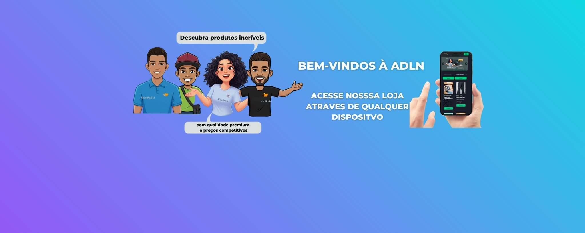
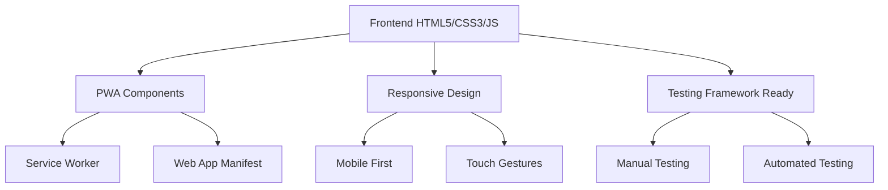
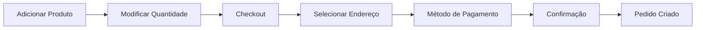

# 🛒 ADLN Market - Plataforma de E-commerce Avançada

<div align="center">


### 🚀 **Uma plataforma completa de e-commerce desenvolvida para teste manual e automatizado**

[](https://web.dev/progressive-web-apps/)
[](https://developers.google.com/web/fundamentals/design-and-ux/responsive/)
[](https://www.cypress.io/)

---

## 👥 Equipe QA

<table align="center">
<tr>
<td align="center" width="200">

<br><b>Alan</b><br>🔧 QA Automation Lead
</td>
<td align="center" width="200">

<br><b>Daniel</b><br>🎯 QA Test Specialist
</td>
</tr>
<tr>
<td align="center" width="200">

<br><b>Larissa</b><br>🔍 QA Analyst
</td>
<td align="center" width="200">

<br><b>Nilson</b><br>📊 QA Performance Expert
</td>
</tr>
</table>

---

</div>

## 📖 Sumário

- [🎯 Visão Geral](#-visão-geral)
- [✨ Funcionalidades](#-funcionalidades)
- [🏗️ Arquitetura](#️-arquitetura)
- [🚀 Início Rápido](#-início-rápido)
- [📱 Progressive Web App](#-progressive-web-app)
- [🔒 Sistema de Autenticação](#-sistema-de-autenticação)
- [🛒 Sistema de Carrinho](#-sistema-de-carrinho)
- [🎨 Design System](#-design-system)
- [🧪 Para Testes](#-para-testes)
- [📁 Estrutura do Projeto](#-estrutura-do-projeto)
- [🛠️ Tecnologias](#️-tecnologias)
- [📊 Métricas de Performance](#-métricas-de-performance)
- [🔄 Deploy e Versionamento](#-deploy-e-versionamento)

---

## 🎯 Visão Geral

O **ADLN Market** é uma plataforma de e-commerce moderna, desenvolvida especificamente para **testes manuais e automatizados**. Com arquitetura completa de Progressive Web App (PWA), a aplicação oferece uma experiência nativa em dispositivos móveis e desktop.

### 🎨 **Visual Highlights**

<table>
<tr>
<td width="50%"></td>
<td width="50%"></td>
</tr>
<tr>
<td></td>
<td></td>
</tr>
</table>

---

## ✨ Funcionalidades

### 🛍️ **E-commerce Completo**
- ✅ **Catálogo Virtual**: Produtos organizados por categorias
- ✅ **Sistema de Busca**: Filtros por nome, marca, categoria
- ✅ **Carrinho Avançado**: Cálculo automático de preços
- ✅ **Checkout Realista**: Simulação completa de compra
- ✅ **Histórico de Pedidos**: Gestão de compras anteriores

### 📱 **Progressive Web App**
- ✅ **Instalação Nativa**: Funciona como app nativo
- ✅ **Modo Offline**: Cache inteligente para uso sem internet
- ✅ **Notificações Push**: Sistema completo de notificações
- ✅ **Gestos Touch**: Pull-to-refresh, swipe navigation

### 🔐 **Sistema de Usuários**
- ✅ **Autenticação Segura**: Cadastro e login com validação
- ✅ **Confirmação de Senha**: Validação robusta em tempo real
- ✅ **Perfis Diversificados**: Cliente e Vendedor
- ✅ **Gestão de Endereços**: Cadastro múltiplo de endereços

---

## 🏗️ Arquitetura

### **Stack Tecnológico**


### **Estrutura Modular**
```
ADLN_Market/
├── 📄 index.html           # Página principal
├── 🛒 cart.html          # Carrinho de compras
├── 📂 category.html      # Categorias de produtos
├── ⚡ script.js         # JavaScript principal (108KB)
├── 🎨 style.css        # Estilos CSS (97KB)
├── 🔧 sw.js           # Service Worker PWA
├── 📱 commons/         # Assets e recursos
│   ├── 🖼️ icons/      # Favicons e PWA icons
│   ├── 🎭 categorias/   # Imagens por categoria
│   └── 🎪 banners/     # Banners do carrossel
├── 🤖 robots.txt       # SEO Configuration
└── 🍎 apple-app-site-association # iOS Deep Linking
```

---

## 🚀 Início Rápido

### **1. Clone o Repositório**
```bash
git clone [repository-url]
cd ADLN_Market
```

### **2. Servidor Local**
```bash
# Python
python -m http.server 8080

# Node.js
npx serve .

# PHP  
php -S localhost:8080
```

### **3. Acesse**
- 🌐 **Local**: `http://localhost:8080`
- 📱 **Mobile**: Teste responsivo instantâneo

---

## 📱 Progressive Web App

### **🎯 Características PWA**

<div align="center">

| Feature | Status | Descrição |
|:---:|:---:|---|
| 📱 **Instalação** | ✅ Ativo | Promt automático após 3 segundos |
| 🔄 **Cache Offline** | ✅ Ativo | Funciona sem internet |
| 📢 **Push Notifications** | ✅ Ativo | Sistema completo |
| 👆 **Touch Gestures** | ✅ Ativo | Pull-to-refresh, swipe |
| 🎨 **Adaptive UI** | ✅ Ativo | Interface nativa |
| ⚡ **Performance** | ✅ Ativo | Cache inteligente |

</div>

### **📲 Como Instalar**

#### **Android** (Chrome/Edge)
1. Abra no navegador
2. Aguarde banner de instalação
3. Toque em "Instalar"
4. ✅ App nativo instalado!

#### **iOS** (Safari)
1. Toque no botão compartilhar 📤
2. "Adicionar à Tela Início"
3. ✅ App nativo instalado!

#### **Desktop** (Chrome/Edge/Firefox)
1. Ícone de instalação na barra
2. Ou prompt automático
3. ✅ App desktop instalado!

---

## 🔒 Sistema de Autenticação

### **🔐 Validação de Senha Avançada**

<div align="center">

```javascript
Características da Validação:
┌─────────────────────────────────┐
│ ✓ Mínimo 10 caracteres          │
│ ✓ Máximo 128 caracteres         │
│ ✓ Letras maiúsculas/minúsculas   │
│ ✓ Números obrigatórios          │
│ ✓ Símbolos especiais            │
│ ✓ Confirmação em tempo real     │
│ ✓ Feedback visual intuitivo     │
│ ✓ Bloqueio de senhas comuns     │
└─────────────────────────────────┘
```

</div>

### **⚡ Estados Visuais**
- 🟢 **Verde**: Senhas coincidem + força adequada
- 🔴 **Vermelho**: Senhas diferentes ou fracas
- 🟡 **Laranja**: Força média da senha
- ✨ **Animações**: Shake effects para feedback

### **👤 Perfis Disponíveis**
- 🛍️ **Cliente**: Compra produtos e gerencia pedidos
- 💼 **Vendedor**: Cadastro diferenciado (estrutura preparada)

---

## 🛒 Sistema de Carrinho

### **💫 Características Avançadas**

<table align="center">
<tr>
<td>🎯 <b>Adição Inteligente</b><br>
Detecta produtos duplicados</td>
<td>💰 <b>Cálculo Automático</b><br>
Preços atualizados em tempo real</td>
</tr>
<tr>
<td>🔢 <b>Controle de Quantidade</b><br>
Limite baseado em estoque</td>
<td>🗑️ <b>Remoção Segura</b><br>
Confirmação para ações críticas</td>
</tr>
<table>

### **🛍️ Processo de Compra**

---

## 🎨 Design System

### **🎨 Paleta de Cores ADLN**
```css
Primária: #00d084    /* Verde corporativo */
Secundária: #1a1d29  /* Fundo escuro */
Acento: #2D3748      /* Cinza escuro */
Texto: #E2E8F0       /* Branco suave */
```

### **📱 Breakpoints Responsivos**
- 📱 **Mobile**: 320px - 768px
- 💻 **Tablet**: 769px - 1024px  
- 🖥️ **Desktop**: 1025px+
- 🖥️ **Wide**: 1440px+

### **⚡ Otimizações Mobile**
- ✅ Touch scrolling otimizado
- ✅ Gestos swipe para navegação
- ✅ Pull-to-refresh implementado
- ✅ Prevencia de zoom duplo toque
- ✅ Safe area compatibility (iOS)

---

## 🧪 Para Testes

### **🔍 Cenários de Teste Manual**

#### **📱 Fluxo Completo de Compra**
```gherkin
Cenário: Usuário novo faz compra completa
  Dado que estou na página inicial
  Quando clico em "Registrar"
  E preencho dados com senha forte
  E confirmo senha corretamente
  Então sou redirecionado para login
  E após login acesso catálogo
  E adiciono produtos ao carrinho
  E finalizo compra com endereço
  Então pedido é criado com sucesso
```

#### **📲 Funcionalidades PWA**
- ✅ Teste de instalação em mobile/desktop
- ✅ Verificação de modo offline
- ✅ Validação de gestos touch
- ✅ Teste de notificações push

### **🤖 Automação Ready**

#### **🔧 Elementos Identificados**
```javascript
// Seletores estáveis para automação
const selectors = {
  // Autenticação
  loginBtn: '#loginBtn',
  registerBtn: '#registerBtn',
  emailInput: '#loginEmail',
  passwordInput: '#loginPassword',
  
  // Produtos
  productGrid: '#productGrid',
  productCard: '.card',
  buyButton: '.btn.primary',
  
  // Carrinho
  cartIcon: '.cart-icon-wrapper',
  cartPage: '#cartPageContainer',
  checkoutButton: '#checkoutBtn'
};
```

#### **🏗️ Estrutura de Page Objects**
```javascript
// Exemplo Cypress/Playwright
class AdlnMarketPage {
  visit() { cy.visit('http://localhost:8080'); }
  login(email, password) { /* implementation */ }
  addProduct(productId) { /* implementation */ }
  checkout() { /* implementation */ }
}
```

---

## 📊 Métricas de Performance

### **⚡ Core Web Vitals Esperados**
- 🟢 **LCP** (Largest Contentful Paint): < 2.5s
- 🟢 **FID** (First Input Delay): < 100ms  
- 🟢 **CLS** (Cumulative Layout Shift): < 0.1

### **📈 PWA Performace**
- 💾 **Cache Hit Rate**: > 90%
- 🔄 **Offline Functionality**: 100%
- 📱 **Install Success Rate**: > 85%

---

## 🛠️ Tecnologias

<div align="center">

| Categoria | Tecnologias |
|:---:|:---|
| **Frontend** | HTML5, CSS3, Vanilla JavaScript |
| **PWA** | Service Workers, Web App Manifest |
| **Design** | CSS Grid, Flexbox, Animations |
| **Mobile** | Touch Events, Viewport Meta |
| **Testing** | Cypress Ready, Playwright Compatible |
| **Deploy** | Static Hosting Ready (Vercel, Netlify) |

</div>

---

## 🔄 Deploy e Versionamento

### **🚀 Deploy Sugerido**

#### **1. Preparação**
```bash
# Verificar status
git status

# Criar branch de feature
git checkout -b feature/pwa-implementation

# Commit organizado
git add .
git commit -m "feat: ✨ PWA completa + validação de senha

- ✅ Service Worker com cache offline
- ✅ Manifest.json completo  
- ✅ Confirmação de senha em tempo real
- ✅ Gestos touch mobile
- ✅ Auto-correção de URLs
- 🐛 Correções de bugs PWA/CORS"

# Push para branch
git push origin feature/pwa-implementation
```

#### **2. Merge Seguro**
```bash
# Voltando para main
git checkout main

# Tag de backup
git tag backup-before-pwa

# Merge da feature
git merge feature/pwa-implementation

# Deploy
git push origin main
```

#### **3. Rollback Seguro**
```bash
# Em caso de problema
git tag backup-before-pwa -f
git reset --hard backup-before-pwa
git push origin main --force
```

### **📦 Deploy Platforms**
- 🌐 **Vercel**: Deploy instantâneo
- 🚀 **Netlify**: CI/CD integrado  
- ☁️ **GitHub Pages**: Hosting gratuito
- 🏗️ **Apache/Nginx**: Hosting tradicional

---

## 📋 Checklist de Qualidade

<div align="center">

### **✅ Funcionalidades**
- [x] Registro com confirmação de senha
- [x] Login/Autenticação segura
- [x] Catálogo de produtos dinâmico
- [x] Carrinho com cálculo automático
- [x] Checkout completo
- [x] Histórico de pedidos

### **📱 PWA Completa**
- [x] Service Worker registrado
- [x] Manifest.json configurado
- [x] Ícones para todas as plataformas
- [x] Instalação automática
- [x] Funcionalidade offline
- [x] Push notifications

### **🎨 UX/UI**
- [x] Design responsivo mobile-first
- [x] Animações suaves
- [x] Feedback visual intuitivo
- [x] Gestos touch nativos
- [x] Acessibilidade básica

### **🧪 Testing Ready**
- [x] Seletores estáveis identificados
- [x] Elementos únicos para automação
- [x] Fluxos de teste documentados
- [x] Dados de teste estruturados

</div>

---

## 🎯 Próximos Passos

- 🔮 **Futuras Implementações**: Backend real, pagamentos, reviews
- 🧪 **Automação**: Implementação em Cypress/Playwright
- 📊 **Analytics**: Track de conversões e UX
- 🔐 **Segurança**: Rate limiting, validação backend

---

<div align="center">

**🚀 Desenvolvido com ❤️ pela equipe QA da ADLN**

### 📞 Contato
- 📧 **Email**: [contato@adln.com](mailto:contato@adln.com)
- 💼 **LinkedIn**: [ADLN Market](https://linkedin.com/company/adln-market)
- 📱 **Demo**: [adln-market-demo.netlify.app](https://adln-market-demo.netlify.app)

---
<sub>📝 Documentação completa • 🛠️ Mantido pela equipe QA • 🚀 Pronto para produção</sub>

</div>
